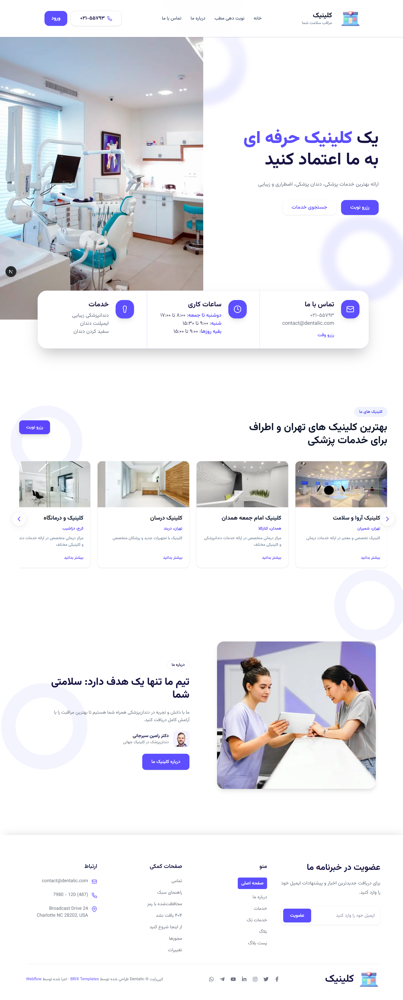

# Clinic Appointment Platform

A full-stack medical appointment booking system with a modern Next.js frontend and a Django REST backend.

## Overview




## Project Structure

- `backend/` — Django REST API server
- `frontend/` — Next.js 16 + React 19 web client
- `API_DOCS.md` — documented backend API endpoints
- `initial_data.json` — optional sample data for seeding

## Key Features

### Authentication
- User registration and login
- Support for patient and doctor roles
- Token-based authentication with JWT access and refresh tokens
- Profile retrieval for authenticated users

### Patient Experience
- Browse medical specialties
- Search doctors by name, specialty, or city
- Book appointments with available doctors
- View patient appointment history
- Submit ratings and reviews for doctors
- Create support tickets for questions or issues

### Doctor / Clinic Features
- Doctor registration with profile details and specialty
- Backend support for doctor availability schedules
- Backend endpoints for doctors to view appointments
- Clinic listing and details
- Specialty listing with related doctors

### Backend Functionality
- Django REST Framework API
- Clinics, specialties, appointments, reviews, tickets modules
- Role-aware endpoints for patients and doctors
- Support for doctors and clinics approval status
- API documentation stored in `API_DOCS.md`

### Frontend UX
- Responsive landing page with hero section
- Authentication page with login and signup
- Appointment search and doctor discovery
- Tailwind CSS-powered styling
- Axios-based API integration
- Modern UI components and page layout

## Architecture

### Backend
- Django 6.0.6
- Django REST Framework
- SQLite database (`db.sqlite3`)
- Apps:
  - `accounts`
  - `appointments`
  - `clinics`
  - `payments`
  - `reviews`
  - `specialties`
  - `tickets`

### Frontend
- Next.js 16.2.6
- React 19.2.4
- Tailwind CSS 4
- Axios for HTTP calls
- Client-side auth context with token management

## Installation

### Backend

```bash
cd backend
python -m venv venv
venv\Scripts\activate
pip install -r requirements.txt
python manage.py migrate
python manage.py runserver
```

### Frontend

```bash
cd frontend
npm install
npm run dev
```

## Running the Project

- Backend: `http://127.0.0.1:8000`
- Frontend: `http://localhost:3000`

If needed, update the API URL in `frontend/lib/api.js`.

## Available Scripts

### Frontend
- `npm run dev` — start development server
- `npm run build` — build production app
- `npm run start` — run production server
- `npm run lint` — lint project files

### Backend
- `python manage.py runserver` — start Django server
- `python manage.py migrate` — apply database migrations

## API Summary

Key backend endpoints include:

- `POST /api/auth/register/` — register a new user
- `POST /api/auth/login/` — login and receive JWT tokens
- `GET /api/auth/profile/` — fetch current user profile
- `GET /api/specialties/` — list medical specialties
- `GET /api/specialties/doctors/` — search doctors by specialty or name
- `GET /api/clinics/` — list active clinics
- `POST /api/appointments/create/` — create a new appointment
- `GET /api/appointments/my/` — patient appointment list
- `GET /api/appointments/doctor/` — doctor appointment list
- `GET /api/appointments/availability/<doctor_id>/` — doctor availability slots
- `POST /api/reviews/create/` — submit a doctor review
- `POST /api/tickets/create/` — open a support ticket

For full endpoint details, see `API_DOCS.md`.

## Notes

- The frontend uses `http://127.0.0.1:8000/api` as the default Django API base URL.
- Add your website screenshot to the project root as `overview.png` or update the image path in this README.
- The app currently uses local development settings and SQLite.

## Contribution

1. Fork the repository
2. Create a new branch
3. Make changes
4. Submit a pull request

---

Thank you for using this clinic appointment platform.
